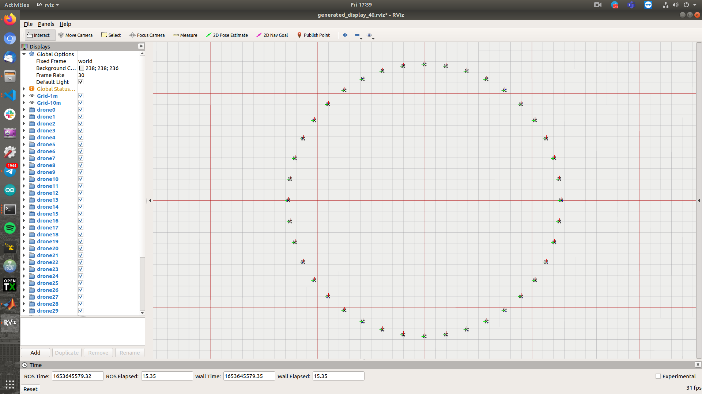
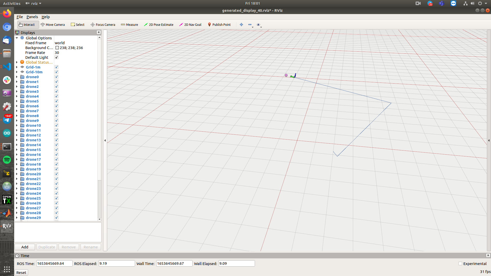

# Simple Quad Simulator ROS
ROS-Rviz Quadcopter playground to test path planning and mapping algorithms (ROS package is called `quad`)

| multiple drone formation | drone with given target | 
| :---: | :---: |
| |  | 


### Setup
```bash
# Git clone this repo into your ws/src directory
cd <Workspace-Source-Directory>
git clone https://github.com/matthewoots/simple_quad_simulator.git
# Go to your ws directory
cd <Workspace-Directory>
catkin build
source devel/setup.bash
```

### Quick run
```bash
roslaunch quad sample.launch
```
### Generated run
```bash
# Acceptable formations are :
# 1. antipodal
# 2. horizontal-line
# 3. vertical-line
# 4. top-down-facing
# 5. left-right-facing
# etc roslaunch quad generated_antipodal_10.launch
roslaunch quad generated_<formation>_<number-of-drones>.launch
```

### Setup multiple drone profiles
1. Generate **display** in rviz
```bash
cd simple_quad_simulator/scripts
python gen_rviz_display.py <number-of-drones>
# The file will be generated in simple_quad_simulator/rviz directory
# etc display_40.rviz

# To run rviz with the display configurations
cd simple_quad_simulator
# etc rosrun rviz rviz -d rviz/generated_display_10.rviz
rosrun rviz rviz -d rviz/generated_display_<number-of-drones>.rviz
```

2. Generate **launch file** for **formation** and **number of uavs**
```bash
# Format is as such : 
# gen_launch.py <number-of-drones> antipodal <radius>
# gen_launch.py <number-of-drones> horizontal-line <spacing>
# gen_launch.py <number-of-drones> vertical-line <spacing>
# gen_launch.py <number-of-drones> top-down-facing <spacing>
# gen_launch.py <number-of-drones> left-right-facing <spacing>
# etc gen_launch.py 10 antipodal 12
cd simple_quad_simulator/scripts
python gen_launch.py <format>
# The file will be generated in simple_quad_simulator/launch directory
```

### Test functionality of drone messages
```bash
cd simple_quad_simulator/scripts
# Test whether single agent can receive /mavros/setpoint_raw/local (Target message)
python test_target.py 
# Test whether single agent can receive /trajectory/points
python test_trajectory.py 
```

## References 
1. Swarm-playground https://github.com/ZJU-FAST-Lab/EGO-Planner-v2